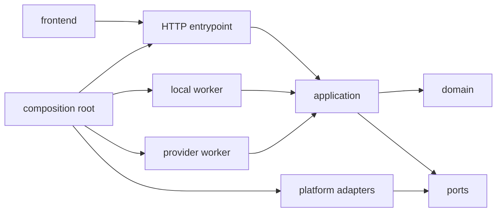
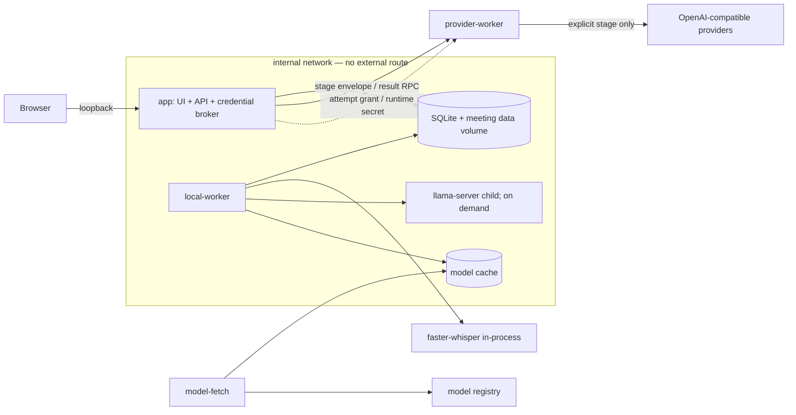
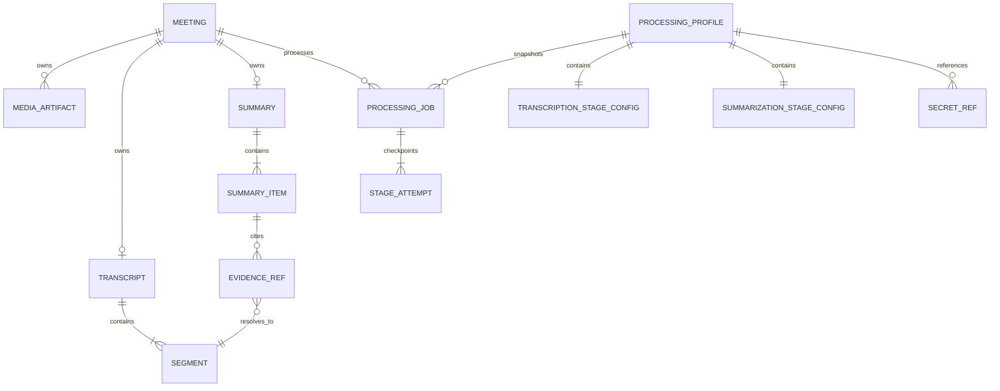

# Architecture Spine — summarization-of-meetings

## Design Paradigm

**Гексагональный модульный монолит с сохраняемым staged pipeline.** Доменные модули: `meetings`, `profiles`, `processing`, `search_export`; интеграции находятся в `platform`; HTTP API и workers — сменные entrypoints одного application core.



## Invariants & Rules

### AD-1 — [ASSUMPTION] Направление зависимостей

- **Binds:** all
- **Prevents:** циклы между возможностями и проникновение SQLite, файлов, HTTP и provider SDK в domain.
- **Rule:** entrypoints зависят от application; application — только от domain и ports; adapters реализуют ports; модули вызывают только публичные application-команды и запросы друг друга.

### AD-2 — [ADOPTED] Владение постоянными данными и media retention

- **Binds:** FR-1–4, FR-10–24, NFR-1, NFR-4
- **Prevents:** двух владельцев данных, битые ссылки, частично опубликованные результаты и удаление media из-под активного reader/job.
- **Rule:** SQLite — источник истины для структурированного состояния; управляемая файловая область — для media, artifacts и models. `Meeting` хранит `lifecycleState=active|mediaDeleting|deleting`, возрастающий `lifecycleEpoch` и slots `sourceArtifactId`/`preparedAudioArtifactId`/`playbackArtifactId`; playback может ссылаться на source либо отдельный derived artifact. `MediaArtifact` принадлежит ровно одному Meeting и хранит role/profile version, относительный ID, size, checksum и `pending|ready|deleting`; source дополнительно хранит `mediaKind=audio|video`, исходные имя/container/codec/duration и оригинальные bytes. Source и published derivatives не имеют TTL. Staging/final находятся на одном filesystem: DB фиксирует `pending`, idempotent rename публикует файл, CAS переводит его в `ready`; reads видят только `ready`. Media-only delete разрешён после успешного job и без active job; full delete доступен отдельно. Оба CAS-ом повышают lifecycle epoch и создают `DeleteIntent(scope=media|meeting)`, запрещающий новые mutations/leases/grants и cancel/revoke attempts. Каждый stream/worker держит persisted artifact lease `(artifactId,ownerId,lifecycleEpoch,expiresAt)` с heartbeat и проверкой epoch перед chunk; intent закрывает app streams, запрещает renew и ждёт release/expiry до unlink. Финальная транзакция `media` null-ит media slots, удаляет artifact rows и возвращает Meeting в `active`, сохраняя text/metadata; `meeting` удаляет все dependent rows/FTS и tombstone. Full-deleting Meeting скрыт из обычных reads; startup reconciliation продолжает intents и очищает pending/orphans.

### AD-3 — [ADOPTED] Сохраняемая state machine обработки

- **Binds:** FR-13–15, NFR-2–5
- **Prevents:** дубли обработки, потерю прогресса, повтор успешных этапов и позднюю запись поверх новых edits/deletion.
- **Rule:** `ProcessingJob` проходит `prepare → transcribe → summarize`; у `Meeting` не более одного активного job, его snapshot неизменяем и фиксирует `lifecycleEpoch`. Каждая lease повышает `leaseEpoch`; heartbeat/checkpoint делают CAS по `(attemptId, leaseEpoch, running)`. Completion дополнительно сверяет current lifecycle/input fingerprint и expected revisions: Transcript для transcribe; source Transcript, current Summary и Tag set для summarize. Только после ready file outputs одна SQLite-транзакция публикует authoritative output/FTS/tags и помечает stage succeeded; mismatch переводит attempt в `superseded` без публикации. Recovery возобновляет первый незавершённый stage. Retry создаёт новую attempt только failed/cancelled stage с тем же job snapshot; изменение profile/language/instructions либо явная regeneration создаёт новый job/snapshot, который может ссылаться на still-valid upstream outputs как `reused`. Cancel проверяется в safe points; старые attempts хранят audit metadata, но не payload/checkpoints.

### AD-4 — [ADOPTED] Независимые контракты движков

- **Binds:** FR-5–10, FR-16–18
- **Prevents:** ложную взаимозаменяемость ASR и LLM и скрытый fallback.
- **Rule:** `TranscriptionEngine` и `SummarizationEngine` — отдельные typed ports. `ProcessingProfile` содержит независимые stage configs: `engineKind`, endpoint identity, model ID/revision/checksum, parameters, capability/adapter versions и optional `secretRef`; все четыре local/provider комбинации поддерживаются. Save profile и start job проверяют capabilities; evidence flow требует timestamped segments. Job snapshot также фиксирует languages и instructions/template revision, а worker читает только его; secret value исключён. Adapter нормализует ошибки; автоматическая замена запрещена.

### AD-5 — [ASSUMPTION] Топология и граница egress

- **Binds:** FR-6–7, SM-5, NFR-1, NFR-7–8
- **Prevents:** исходящий трафик локального этапа и случайную публикацию UI в LAN.
- **Rule:** Compose содержит `app`, `local-worker`, stateless `provider-worker` и одноразовый `model-fetch`. `app`/`local-worker` имеют только internal network; `provider-worker` подключён к ней и отдельной egress network, но не монтирует SQLite, meeting-data или models. Host port слушает только `127.0.0.1`/`::1`; bundle не использует CDN, telemetry или remote assets. Versioned generated RPC contract фиксирует TLS, workload auth, streaming и compatibility; любой non-loopback provider origin требует HTTPS с certificate/hostname validation. Envelope содержит `dispatchId`, attempt/lease/lifecycle epoch, stage, input fingerprint, snapshot digest, consent proof и opaque grant. `consentProof` связывает accepted time/policy version с digest от stage, profile revision, endpoint origin, provider/model, data categories и snapshot; любое изменение инвалидирует proof. Payload allowlist: prepared audio + language/config либо current transcript chunks + instructions/config. SQLite в `app` владеет `ProviderDispatch` ledger `prepared|inFlight|succeeded|failedKnown|outcomeUnknown`. Worker ACK без egress возвращает authenticated session nonce, связанный со всем envelope; app CAS-ом проверяет current running attempt + lease/lifecycle epochs, сохраняет `inFlight(workerNonce)`, затем по той же authenticated RPC session выдаёт single-use commit token. Только ACK-ing worker с matching nonce/token может сделать один provider call; restart теряет право egress. После `inFlight` тот же dispatch автоматически не отправляется снова; app возвращает cached result либо `outcomeUnknown`, а явный retry создаёт новый attempt/dispatch ID.

### AD-6 — [ASSUMPTION] Секреты живут только в runtime

- **Binds:** FR-5, FR-7, NFR-1, NFR-5
- **Prevents:** сохранение ключей в DB, jobs, export или logs.
- **Rule:** `SecretProvider` port за memory-only broker разрешает `secretRef` только по single-use opaque attempt grant; TTL не длиннее stage lease, revoke происходит при completion, cancel и restart. Ключ вводится для текущей UI-session либо передаётся launcher-у через stdin и существует только в памяти app/provider attempt. Он запрещён в Compose YAML/env-file, DB, job/event, CLI args, durable queue и logs; restart переводит попытку в `waitingForSecret`. OS keychain — отдельное будущее решение.

### AD-7 — [ADOPTED] Provenance переживает редактирование

- **Binds:** FR-10–12, FR-16–18, FR-20–21, SM-3–4
- **Prevents:** непроверяемое саммари после изменения расшифровки.
- **Rule:** `Transcript` имеет возрастающую `revision`; validator требует unique IDs, `0 ≤ startMs < endMs ≤ mediaDuration`, стабильный порядок и отсутствие chunk duplicates. `EvidenceRef` обязан разрешаться в segment той же revision. `Summary` хранит source revision, job-snapshot digest, `generatedAt`, `manualEdit`; edit делает его `stale`, unresolved evidence — `unverified`. Невалидный output не завершает stage. Полная manual replacement требует подтверждения и revision precondition; постоянна только текущая версия.

### AD-8 — [ASSUMPTION] Структурированная суммаризация

- **Binds:** FR-16–18, FR-22, SM-4
- **Prevents:** несовместимые свободные ответы моделей, потерю provenance на длинных встречах и автотеги без успешного Summary.
- **Rule:** pipeline передаёт модели сегменты со стабильными IDs, извлекает типизированные candidates по token-budget chunks, сводит только candidates вместе с evidence IDs и проверяет итог доменной JSON Schema, включая `autoTags`. Только валидатор одной транзакцией публикует `Summary` и нормализованные/дедуплицированные auto tags; failed stage не меняет tags. Новая успешная summarization заменяет только прежние `origin=auto` tags, сохраняя `origin=manual`; edit auto tag сначала переводит его в manual, а явная regeneration может заново предложить ранее удалённый auto tag.

### AD-9 — [ASSUMPTION] Локальный текстовый и structured task-number search

- **Binds:** FR-3, FR-19, FR-24, NFR-1–2
- **Prevents:** внешний поиск, расходящиеся индексы и отдельную поисковую инфраструктуру.
- **Rule:** SQLite FTS5 индексирует title, текущие `Segment` и текущий `Summary` в транзакции их публикации. `Meeting.task_number` — display `TEXT`; backend-only normalizer v1 применяет Unicode NFKC, trim Unicode White_Space и full casefold, затем UTF-8 bytes сохраняются как `task_number_norm BLOB`. Non-unique partial B-tree `ix_meeting_task_number_norm(task_number_norm, id) WHERE task_number_norm IS NOT NULL` обслуживает exact `key = :p` и prefix `key >= :p AND key < :upper`; backend bind-ит BLOB `upper = p + 0xFF`, а valid UTF-8 не содержит `FF`, поэтому bound каноничен. Пустой/контрольный normalized query не допускается; clients norm не вычисляют; fuzzy, contains, FTS и semantic fallback запрещены. Structured path упорядочен по `(task_number_norm,id)` и paginated; все индексы детерминированно rebuild/repair-ятся из authoritative tables и проходят release benchmark под compute load.

### AD-10 — [ASSUMPTION] Обновление, backup и restore

- **Binds:** FR-2, FR-4, FR-14, NFR-4, NFR-8
- **Prevents:** несовместимую схему после обновления и backup без соответствующих media.
- **Rule:** Alembic имеет один linear forward-only head. До API/workers migration gate берёт persisted exclusive maintenance lock, запрещает mutations/new leases, drain/cancel-ит workers, проверяет место и создаёт backup во временной generation. Manifest перечисляет DB snapshot и точные artifacts/checksums и атомарно получает `complete`; только затем идёт migration. Ошибка не запускает services. Restore разворачивает и проверяет новую generation, затем одним recoverable atomic pointer switch активирует её; rollback запускает pinned совместимую версию приложения.

### AD-11 — [ASSUMPTION] Единый внешний контракт

- **Binds:** all UI/API capabilities, NFR-2, NFR-5–6
- **Prevents:** расхождение frontend/backend DTO и нестабильные форматы.
- **Rule:** REST JSON API живёт под `/api/v1`; OpenAPI — единственный источник frontend client/DTO. `GET /api/v1/meetings` принимает `taskNumber` только вместе с `taskNumberMatch=exact|prefix`; repeated `status`/`tag`/`participantId` values образуют OR внутри facet, а facets, date range и taskNumber объединяются AND. OpenAPI фиксирует bounded `limit` + opaque `cursor`; cursor связан с filter/sort digest, response возвращает canonical filter echo, `matchedField=taskNumber`/`matchKind` и `nextCursor`. Frontend URL использует те же query names/repetition, поэтому Back восстанавливает точный filter state; no-hit — `200` с пустой page и echo без другого search path. Meeting DTO выдаёт URL только ready `playbackArtifactId`; `/api/v1/meetings/{meetingId}/media/playback` stream-ит stored representation без filesystem path и без compression/transformation middleware. `GET` без Range → `200`; один bounded/open/suffix bytes range → `206` с `Content-Range`; unsatisfiable → `416` с `Content-Range: bytes */N`; malformed/multi-range → `400`; `HEAD` игнорирует Range и повторяет headers `200` без body. Успех всегда несёт `Content-Encoding: identity`, correct `Content-Type`/`Content-Length`, `Accept-Ranges: bytes`, strong checksum `ETag` по stored playback bytes и `Content-Disposition: inline`; unavailable/deleting → stable `media_not_available`. SSE cursor — persisted monotonic revision per job, event — replaceable state snapshot; reconnect отдаёт последующие revisions либо current `resync` при gap/pruning, клиент игнорирует stale revisions, terminal state доступен через REST. IDs — UUIDv7, время — RFC 3339 UTC, offsets — integer ms; ошибки — RFC 9457 со stable `code`, `stage`, `retryable`.

### AD-12 — [ASSUMPTION] Ресурсный и модельный baseline

- **Binds:** FR-6, FR-9–10, FR-16–17, NFR-2–3, SM-2–5
- **Prevents:** одновременную загрузку моделей сверх 16 ГБ и неповторяемое качество.
- **Rule:** `LocalResourceCoordinator` владеет exclusive model-residency lease. После transcription `local-worker` выгружает ASR, подтверждает освобождение памяти, запускает pinned `llama-server` как child; после summary завершает его. Одновременно resident одна heavy model; gate измеряет peak RSS всего Compose. CPU/int8 runtime — baseline, accelerator — optional profile. Начальные candidates: Whisper large-v3-turbo CT2 и Qwen3-4B-GGUF Q4_K_M.

### AD-13 — [ASSUMPTION] Импорт — одна атомарная команда

- **Binds:** FR-1–2, SM-2, NFR-2–4
- **Prevents:** job для невалидного media, частичный импорт и загрузку файла целиком в RAM.
- **Rule:** intake command принимает ровно один audio- или video-source и stream-ит оригинальные bytes в staging; `ffprobe` определяет media kind/container/codec/duration и проверяет читаемость, audio track, decodability и применимые лимиты. Только после успеха одна транзакция создаёт `Meeting`/source artifact, а rename публикует файл; при rejection staging очищается, job не создаётся. Stage `prepare` идемпотентно публикует canonical `preparedAudio` (`audio/wav`, PCM s16le, mono, 16 kHz; profile `asr-audio-v1`) для обоих media kinds. `playbackArtifactId` ссылается на source только при allowlisted Chromium+Firefox container/codec; иначе prepare создаёт profile `playback-v1`: audio WebM/Opus либо video WebM/VP9+Opus. Derived identity = SHA-256 canonical tuple `(meetingId,sourceArtifactId,sourceChecksum,role,profileVersion)`; unique `(meetingId,sourceArtifactId,role,profileVersion)` исключает дубль без cross-Meeting sharing. Published derivatives хранятся до media/full deletion. Transcription engines читают только preparedAudio; player — только playback artifact. Audio formats/limits остаются OQ-1 release gate.

### AD-14 — [ASSUMPTION] Воспроизводимый open-source release gate

- **Binds:** NFR-3, NFR-7–10, SM-2–5
- **Prevents:** выпуск непереносимого baseline и артефактов с неясными правами.
- **Rule:** release проходит Linux/macOS/Windows × 16-GB CPU, corpus quality/resource gates, one-screen happy path и clean-host Compose install ≤20 min без model download. Каждый supported corpus source обязан завершить AD-13 prepare и воспроизводиться/seek-иться через playback endpoint в Chromium/Firefox; manifest pin-ит browser codec allowlist и FFmpeg `pcm_s16le`/`libopus`/`libvpx-vp9` availability. UI gate проверяет WCAG 2.2 AA outcomes финального UX: keyboard/focus, labels/non-color status, contrast, 200%/320-CSS-px reflow, 44×44 product controls, reduced motion, эквивалентные audio/video controls и evidence seek/focus. Корневой код — Apache-2.0; NOTICE, SBOM и manifest фиксируют image/runtime/model/source/checksum/license, FFmpeg flags/codecs и PyAV provenance. Провал gate заменяет candidate за AD-4 port.

### AD-15 — [ASSUMPTION] Операционные бюджеты — release contracts

- **Binds:** NFR-2–5, SM-2
- **Prevents:** формально корректное, но блокирующее UI приложение.
- **Rule:** API не исполняет compute; import/provider upload — streaming; list/search — bounded и paginated. Под активным local job release benchmarks требуют: library/navigation ≤2 s на 1000 meetings, p95 UI/API response ≤1 s, persisted progress/heartbeat ≤5 s, cancel safe point ≤10 s.

### AD-16 — [ADOPTED] Ant Design — единая frontend design system

- **Binds:** all frontend UI, final UX, NFR-6
- **Prevents:** параллельные component systems, расходящиеся theme/accessibility semantics и хрупкие overrides внутренних DOM-структур.
- **Rule:** production UI использует `antd` components и штатный API Ant Design 6. Единственный root имеет порядок `ConfigProvider → App → product routes`, задаёт русскую locale, system light/dark algorithms и design/component tokens; feedback/overlay вызываются только context-bound hooks/`App.useApp()`, не static APIs. Product code использует component props, composition и tokens: CSS, CSS Modules, styled wrappers, internal selectors и visual `styles`/`classNames` hooks запрещены; browser-native `<video controls>`/`<audio controls>` — единственное исключение, fallback controls собираются из `antd`. До первого frontend feature merge feasibility spike обязан доказать нормативные content-max/sticky/reflow/44×44/focus patterns только разрешёнными API; failure блокирует merge и требует отдельного design decision. UX accessibility contracts и tests обязательны поверх defaults.

## Consistency Conventions

| Concern | Convention |
| --- | --- |
| Naming | Python/DB — `snake_case`; TypeScript/JSON — `camelCase`; types/entities — `PascalCase`; IDs — lowercase UUIDv7. |
| Data | UTF-8; UTC RFC 3339; media time — integer ms; file paths relative to managed root; `taskNumber` сохраняет display value, `taskNumberNorm` подчиняется AD-9; exports include model, manual/stale/unverified markers. |
| Mutation | UI вызывает application commands; один transaction boundary на command или stage checkpoint; adapters не меняют domain state напрямую. |
| Errors and retry | RFC 9457 + stable code. До двух автоматических provider retries разрешены только при доказанном `not accepted` либо provider idempotency; ambiguous outcome → `outcomeUnknown` и явный новый attempt. Auth, validation и missing model не повторяются. |
| Events | SSE events подчиняются cursor/resync contract AD-11 и несут job, stage, state и optional progress. |
| Logging | Structured local logs: correlation/job/stage/error metadata; без secrets, полного transcript, summary и provider payloads. |
| Config | Несекретные значения: environment → checked-in defaults. Секреты подчиняются AD-6. Неизвестная переменная или model/profile ID вызывает fail-fast. Frontend CSP разрешает соединения только с `self`; remote assets запрещены. |
| Release | Images pin-ятся digest; SBOM, NOTICE, checksums, model/runtime revisions и лицензии входят в release manifest; gates подчиняются AD-14–16. |

## Stack

| Name | Version |
| --- | --- |
| [Python](https://www.python.org/downloads/release/python-31315/) | 3.13.15 |
| [FastAPI](https://github.com/fastapi/fastapi/releases/tag/0.141.1) | 0.141.1 |
| [SQLAlchemy](https://github.com/sqlalchemy/sqlalchemy/releases/tag/rel_2_0_52) | 2.0.52 |
| [Alembic](https://github.com/sqlalchemy/alembic/releases/tag/rel_1_19_1) | 1.19.1 |
| [SQLite](https://www.sqlite.org/releaselog/3_53_4.html) | Python linked to 3.53.4 + FTS5 + WAL; startup asserts version/options; known network filesystems rejected |
| [FFmpeg](https://ffmpeg.org/download.html) | 9.0.1 |
| [React](https://react.dev/versions) | 19.2.7 |
| [Ant Design](https://github.com/ant-design/ant-design/releases/tag/6.6.2) | 6.6.2; React ≥18, React 19 supported natively; theme via `ConfigProvider` tokens |
| [TypeScript](https://github.com/microsoft/TypeScript/releases/tag/v6.0.3) | 6.0.3 |
| [Vite](https://github.com/vitejs/vite/releases/tag/v8.2.2) | 8.2.2 |
| [Node.js](https://nodejs.org/en/download) | 24.20.0 LTS; build only |
| [Docker Compose](https://docs.docker.com/desktop/release-notes/) | 5.4.0 |
| [faster-whisper](https://github.com/SYSTRAN/faster-whisper/releases/tag/v1.2.1) | 1.2.1 |
| [llama.cpp](https://github.com/ggml-org/llama.cpp/releases/tag/v0.3.0) | 0.3.0 |
| [Whisper large-v3-turbo CT2](https://huggingface.co/dropbox-dash/faster-whisper-large-v3-turbo) | `0a363e9161cbc7ed1431c9597a8ceaf0c4f78fcf/model.bin`; SHA-256 `e76620f83d5f5b69efd3d87e3dc180c1bd21df9fbebacfd4335e5e1efcc018da`; FP16 artifact, CPU `computeType=int8` |
| [Qwen3-4B-GGUF](https://huggingface.co/Qwen/Qwen3-4B-GGUF) | `bc640142c66e1fdd12af0bd68f40445458f3869b/Qwen3-4B-Q4_K_M.gguf`; SHA-256 `7485fe6f11af29433bc51cab58009521f205840f5b4ae3a32fa7f92e8534fdf5` |

## Structural Seed

```text
summarization-of-meetings/
  backend/src/meeting_app/
    modules/                 # meetings, profiles, processing, search_export
    platform/                # sqlite, filesystem, engines, media, HTTP
    entrypoints/             # API, local worker, provider worker, maintenance CLI
    bootstrap/               # composition roots only
  frontend/src/app/          # Ant Design composition root, locale and theme tokens
  frontend/src/features/     # UI slices consuming the generated API client
  migrations/                # one linear Alembic history
  deploy/                    # Compose, images, model/release manifests
```





## Capability → Architecture Map

| Capability / Area | Lives in | Governed by |
| --- | --- | --- |
| FR-1–4 — import, library, retention | `meetings`, filesystem/media adapters | AD-2, AD-10, AD-13 |
| FR-5–8 — profiles and privacy boundary | `profiles`, engine adapters, credential broker | AD-4–6 |
| FR-9–12 — transcription and editing | `processing`, `meetings`, media/ASR adapters | AD-2–4, AD-7, AD-12 |
| FR-13–15 — durable jobs | `processing`, worker entrypoints | AD-3, AD-5 |
| FR-16–18 — summary and evidence | `meetings`, `processing`, LLM adapters | AD-4, AD-7–8, AD-12 |
| FR-19–21 — search and export | `search_export` | AD-7, AD-9, AD-11, conventions |
| FR-22–24 — tags, participants, external task | `meetings`, `search_export` | AD-2, AD-9, AD-11 |
| NFR-1–10 — operations, accessibility and delivery | `platform`, `entrypoints`, `deploy`, frontend | AD-2–6, AD-10–16 |

## Deferred

- **Promotion of local model candidates:** выполнить AD-14 gates до `local processing` feature complete; заменить candidate за AD-4 port при любом провале.
- **Automatic diarization:** keep speaker labels in the domain contract, but choose a local diarization adapter only after ASR baseline and license/resource tests pass.
- **GPU/Metal/DirectML tuning:** CPU remains the supported baseline; add accelerator profiles only after per-OS measurements, without changing domain or provider contracts.
- **ASR chunk overlap/dedup algorithm:** owned wholly by the transcription adapter; fix it when corpus tests expose the required accuracy/performance trade-off.
- **Direct-audio formats and limits:** продуктовый OQ-1 должен быть закрыт до реализации direct audio intake и фиксации release corpus; единый audio/video intake и storage contract AD-2/AD-13 от выбора не меняется.
- **Detailed schema, SQL indexes кроме FTS5/taskNumber, prompt wording:** code-owned unless a cross-module incompatibility appears.
- **Remote exposure, authentication, multi-user data ownership, native packages, semantic search and plugin catalog:** outside MVP; require a higher-altitude architecture update.
- **OS keychain integration:** runtime broker по AD-6 остаётся baseline; выбрать portable keychain adapter только отдельным решением после проверки трёх ОС.
- **Update revisit gates:** AD-2/3 — delete/range/provider-read и stale-completion fault injection; AD-5 — crash matrix между ACK/inFlight/commit/result; AD-9 — Unicode, leading-zero и pagination contract tests; AD-11/13 — Range matrix и all-format playback/seek на трёх ОС; AD-16 — no-CSS feasibility spike до первого frontend feature merge.
- **Reviewer medium follow-ups:** до Participant CRUD — detach-without-transcript-change tests; до model preparation — staged checksum + atomic model `ready`; до library integration — repeated-facet/cursor/URL/Back contract tests; до delete flow — UI состояния persisted intent, remaining artifacts, retry и lease expiry; до epic split — разнести aggregated NFR map по точным AD owners.
- **Fast-path assumption revisit gates:** AD-1 — dependency test до первого module merge; AD-5/6 — threat/data-flow и secret-restart tests до provider flow; AD-8 — schema/corpus fixtures до summarization; AD-9 — 1000-meeting benchmark under load до search complete; AD-10 — restore drill до первой migration; AD-11 — OpenAPI/SSE reconnect tests до frontend integration; AD-12 — corpus/peak-RSS до local processing complete; AD-13 — crash injection до intake release; AD-14/15 — OS/license/SBOM/performance gates до первого public release.
